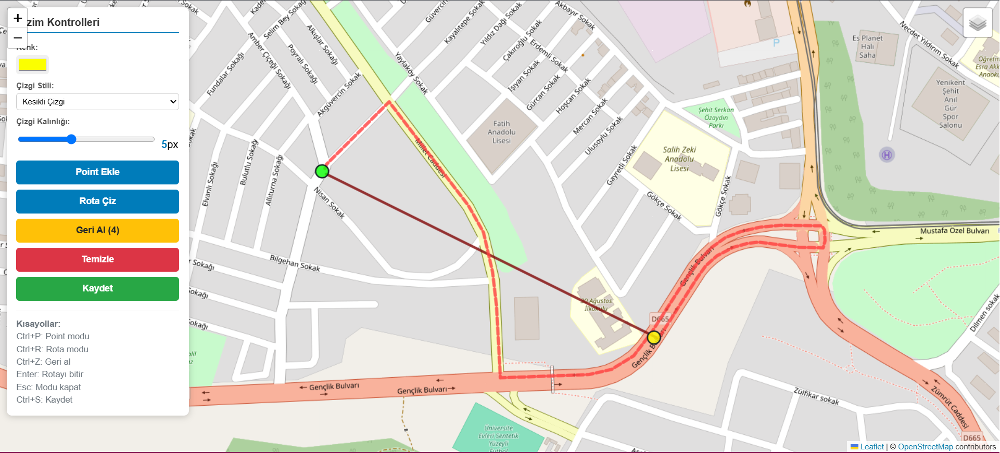

# İnteraktif Harita Çizim Uygulaması

**[English Version →](#interactive-map-drawing-application)**

Bu proje, Leaflet.js tabanlı interaktif bir harita uygulamasıdır. Kullanıcılar harita üzerinde noktalar ekleyebilir, rotalar çizebilir ve çizimlerini kaydedebilir.

## 🌐 Canlı Uygulama

**[Uygulamayı Deneyin →](https://pilestin.github.io/interactive-map/src/index.html)**

## Özellikler

- **İnteraktif Harita**: CartoDB Light, OpenStreetMap, CartoDB Dark ve Satellite katmanları
- **Nokta Ekleme**: Farklı renklerde nokta işaretleyicileri
- **Rota Çizimi**: Özelleştirilebilir çizgi stilleri (düz, kesikli, noktalı)
- **Renk Seçimi**: Hex renk seçici ile özel renkler
- **Çizgi Kalınlığı**: 2-10px arası ayarlanabilir kalınlık
- **Geri Alma**: Son işlemleri geri alma özelliği
- **Kaydetme/Yükleme**: Çizimleri localStorage ve JSON dosyası olarak kaydetme
- **Klavye Kısayolları**: Hızlı erişim için klavye desteği

## Kullanım

### Temel İşlemler

1. **Nokta Ekleme**: "Point Ekle" butonuna tıklayın veya Ctrl+P tuşlarını kullanın
2. **Rota Çizimi**: "Rota Çiz" butonuna tıklayın veya Ctrl+R tuşlarını kullanın
3. **Renk Değiştirme**: Renk seçiciyi kullanarak çizim rengini değiştirin
4. **Stil Seçimi**: Açılır menüden çizgi stilini seçin (düz, kesikli, noktalı)
5. **Kalınlık Ayarı**: Kaydırıcı ile çizgi kalınlığını 2-10px arası ayarlayın

### Klavye Kısayolları

- `Ctrl+P`: Nokta ekleme modu
- `Ctrl+R`: Rota çizme modu
- `Ctrl+Z`: Geri alma
- `Ctrl+S`: Çizimleri kaydetme
- `Enter`: Mevcut rotayı bitirme
- `Esc`: Aktif modu kapatma

---

# Interactive Map Drawing Application

This project is an interactive map application based on Leaflet.js. Users can add points, draw routes, and save their drawings on the map.

## 🌐 Live Application

**[Try the Application →](https://pilestin.github.io/interactive-map/src/index.html)**

## Features

- **Interactive Map**: CartoDB Light, OpenStreetMap, CartoDB Dark, and Satellite layers
- **Add Points**: Markers in different colors
- **Draw Routes**: Customizable line styles (solid, dashed, dotted)
- **Color Picker**: Custom colors with a hex color picker
- **Line Thickness**: Adjustable thickness between 2-10px
- **Undo**: Undo the last actions
- **Save/Load**: Save drawings to localStorage or as a JSON file
- **Keyboard Shortcuts**: Quick access with keyboard support

## Usage

### Basic Operations

1. **Add Points**: Click the "Add Point" button or use Ctrl+P
2. **Draw Routes**: Click the "Draw Route" button or use Ctrl+R
3. **Change Color**: Use the color picker to change the drawing color
4. **Select Style**: Choose a line style (solid, dashed, dotted) from the dropdown
5. **Adjust Thickness**: Use the slider to set line thickness between 2-10px

### Keyboard Shortcuts

- `Ctrl+P`: Point mode
- `Ctrl+R`: Route drawing mode
- `Ctrl+Z`: Undo
- `Ctrl+S`: Save drawings
- `Enter`: Finish the current route
- `Esc`: Exit the active mode
